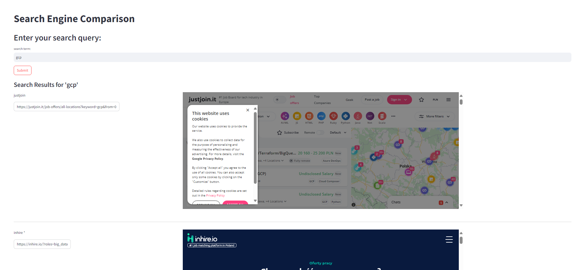

# pyproject-template

[](https://github.com/obar1/onepage_job_lister/actions/workflows/makefile.yml) 
[](https://codespaces.new/obar1/onepage_job_lister?quickstart=1)

> (very) simple job website lister (in one page)
> I know very little about web - `feel free to add more to this repo`



just open this repo in your GitHub Codespace and run the demo as:

## usage 

```bash
bash demo.sh
``` 

tune contents of 
```
def get_engines() -> dict:
```

## debug
> vs code 
use [here](.vscode/launch.json)
```json
{
    "version": "0.2.0",
    "configurations": [
        {
            "name": "Python:Streamlit",
            "type": "debugpy",
            "request": "launch", 
            "module": "streamlit",
            "args": ["run", "${file}"]
        }
    ]
}

```
and use it as


with braskpoints where needed :)
